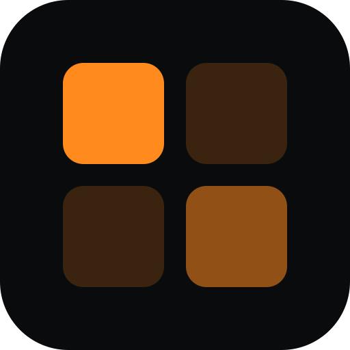
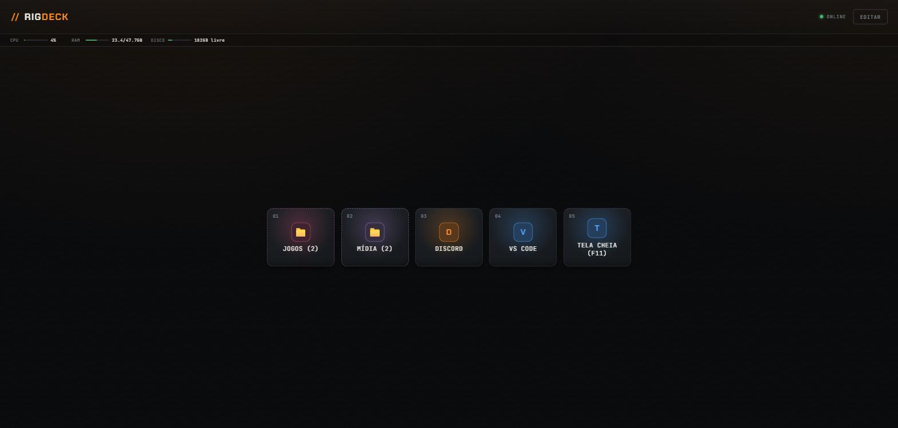

<div align="center">



# // RigDeck

**A Stream Deck with no hardware.**<br>
Your phone opens a web page and controls your Windows PC over the local network: launch apps, games and sites, place windows on specific monitors, and close what you opened with a tap. No native app on the phone.

[](LICENSE)
[](https://github.com/obrenoalvim/rigdeck/stargazers)
[](#prerequisites)
[](#stack)
[](#stack)
[](#features)

**English** · [Português](README.pt-BR.md)

[Features](#features) · [Quick start](#quick-start) · [How it works](#how-it-works) · [Stack](#stack) · [Usage](#usage) · [FAQ](#faq) · [Landing page](https://rigdeck.vercel.app)

</div>

---



## Quick start

```bash
git clone https://github.com/obrenoalvim/rigdeck.git
cd rigdeck
npm install
npm run build
npm start
```

Open `http://localhost:4321` on your PC, or `http://<your-pc-ip>:4321` from your phone on the same network. Details are under [Getting started](#getting-started).

## About

RigDeck started from one specific problem: gaming with friends meant opening
Discord on one monitor and the game on another, by hand, every single time.
It grew into a full automation panel: a grid of configurable buttons
organized in folders, just like a real Stream Deck, served as a PWA. A small
backend drives Windows underneath.

It's a personal desktop automation tool, built to run on a local network
controlling a single machine. This repository serves as an architecture
reference and a base for anyone who wants to adapt it to their own setup.

## How it works

```
┌─────────────┐         HTTP (local network)     ┌──────────────────┐
│   Phone /    │ ───────────────────────────────▶ │   Fastify API     │
│   any        │ ◀─────────────────────────────── │   (Node + TS)      │
│   browser    │            JSON                  └─────────┬────────┘
└─────────────┘                                              │
  Static PWA                                       spawns processes
  (vanilla JS, no                                              │
   build step)                                                 ▼
                                                    ┌──────────────────┐
                                                    │  PowerShell       │
                                                    │  scripts           │
                                                    └─────────┬────────┘
                                                              │
                                                   Win32 API (SetWindowPos,
                                                   ShowWindow, SendKeys,
                                                   EnumWindows, taskkill...)
                                                              │
                                                              ▼
                                                      Real Windows windows
```

1. **Frontend.** Plain JavaScript PWA, no framework, no build step, served
   as static files. The button grid (presets) is organized in folders, the
   editor is built into the app itself, and the client reloads itself when
   the server ships a new version.
2. **Backend.** Fastify API in TypeScript. Receives the request to run a
   preset, resolves its steps, and calls the executor.
3. **Executor.** Decides how each step runs: opens a program, sends a key,
   runs a command, or closes something that was already open.
4. **PowerShell scripts.** The layer that talks to Windows: enumerate
   monitors, move and resize windows via the Win32 API, extract icons from
   `.exe` files, discover games installed on Steam and Epic, send keys via
   `SendKeys`.

Each layer only knows its neighbor's interface: the frontend doesn't know
PowerShell exists, the executor doesn't know a button grid exists. Each one
can be tested in isolation.

## Features

- **Presets in folders.** Organizes shortcuts in nested folders, just like
  Elgato's physical Stream Deck.
- **Five step types per preset.**
  - `launch`: opens an `.exe`, shortcut, protocol (`steam://`,
    `epicgames://`) or URL, with per-monitor window positioning and optional
    fullscreen.
  - `cmd`: runs any shell command and returns the output.
  - `key`: sends a keystroke (F11, ESC, Alt+Enter...) to the focused window
    or to a specific process. Includes `MAXIMIZE`/`RESTORE` as real window
    actions, which don't depend on the app listening for the key.
  - `sound`: plays a local audio file without blocking the preset.
  - `obs`: drives OBS via its WebSocket API (switch scene, mute/unmute mic,
    start/stop recording or streaming).
- **Multi-step presets.** One button opens Spotify, Brave and VS Code at
  once, for example.
- **Per-monitor positioning.** Each step picks its monitor and decides
  whether to go fullscreen or use a specific position and size.
- **Hold to close.** Holding a button closes exactly what that preset
  opened, tracked by PID or HWND. It doesn't kill processes with the same
  name that were already open for another reason.
- **URLs in their own window.** Open via `--app=`, with no tabs or address
  bar, and close individually without taking down the whole browser.
- **Automatic program discovery.** Scans the Start Menu, Desktop, and the
  Steam and Epic Games Launcher manifests, and classifies what's a game and
  what's a regular program on its own.
- **Audio mixer.** Adjust master, mic and per-app volume, a 2-band EQ, and a
  voice effect, plus a soundboard with keyboard/Discord-keybind triggers.
- **OBS control.** Switch scenes, mute the mic, and start/stop
  recording or streaming, straight from a preset.
- **File-folder browsing.** Point a preset at a folder and browse it as a
  grid of tappable files, without pre-registering each one.
- **Live stats.** CPU, RAM and free disk in the status bar, plus Claude Code
  5h/weekly usage percentage (account-wide, so it stays current even when
  usage happens on another machine). Pick which tiles show from the CONFIG
  panel.
- **Installable PWA.** Works as a home-screen app on the phone, with a
  compact landscape layout: up to 4 buttons per page, in a sliding tray,
  like phone app icons.
- **Export and import.** Back up all presets in a single JSON file.
- **Auto-start without admin.** Starts itself on login via a shortcut in the
  Windows Startup folder, with no elevated privileges required.

## Stack

| Layer | Technology |
|---|---|
| Backend | [Fastify](https://fastify.dev) + TypeScript, Node.js 20+ |
| Frontend | Plain JavaScript (ES modules), zero framework, zero build step |
| Automation | PowerShell (Win32 API via inline `Add-Type`) |
| Tests | native `node:test`, `tsx` as the loader |
| Persistence | Local JSON (no database) |

## Why Fastify?

The original backend used Express. The switch to Fastify and TypeScript was
deliberate for this public version: end-to-end typing, native route schemas,
a base closer to what's used in production. The minimalist philosophy stays
the same: no ORM, no dependency injection layer, no abstraction the project
doesn't need.

## Getting started

### Prerequisites

- Windows 10/11
- [Node.js](https://nodejs.org) 20 or newer
- PowerShell (already on Windows)

### Installation

```bash
git clone https://github.com/obrenoalvim/rigdeck.git
cd rigdeck
npm install
npm run build
npm start
```

The server starts at `http://localhost:4321`. Access it from any device on
the same local network via the machine's IP (`http://192.168.x.x:4321`).

For development with automatic reload:

```bash
npm run dev
```

### Configuration

Copy `.env.example` to `.env` if you want to change the port or the presets
file path:

```bash
cp .env.example .env
```

### Auto-start on login, no admin required

```powershell
powershell -ExecutionPolicy Bypass -File scripts\install-startup-shortcut.ps1
```

Creates a shortcut in the Windows Startup folder that starts the server on
its own on every login.

## Usage

1. Open `http://localhost:4321`, or the machine's IP, on your phone or
   browser.
2. Tap **EDITAR** (edit) to open the configuration panel.
3. Create a folder or a shortcut, pick the step type (**Launch**, **CMD
   Command** or **Key**), fill in the target and save.
4. Tap the button you created to run the preset. Hold it to close what it
   opened.

### Example: Discord and a game on separate monitors

```json
{
  "name": "Gaming session",
  "steps": [
    { "type": "launch", "target": "C:\\...\\Discord.exe", "monitor": 0 },
    { "type": "launch", "target": "steam://rungameid/730", "monitor": 1, "fullscreen": true }
  ]
}
```

## Project structure

```
rigdeck/
├── src/
│   ├── server.ts        # Fastify routes
│   ├── types.ts         # shared types
│   └── lib/
│       ├── executor.ts       # decides how each step runs
│       ├── presets-store.ts  # persistence (local JSON)
│       ├── launch.ts         # opens programs/URLs
│       ├── stats.ts          # CPU/RAM/disk/Claude usage
│       ├── icons.ts          # extracts icons from .exe files
│       └── monitors.ts, programs.ts, json-array.ts
├── scripts/            # PowerShell: the layer that talks to Windows
├── public/             # PWA (plain HTML/CSS/JS, no build)
├── test/               # node:test
└── run-hidden.vbs      # starts the server without opening a console window
```

## Known limitations

- **Windows only.** All window control depends on the Win32 API via
  PowerShell.
- **One machine, one user, one local network.** There's no authentication.
  Don't expose port 4321 to the internet without something in front of it,
  like a VPN or a reverse proxy with auth.
- **In-memory tracking.** Restarting the server clears the fine-grained
  PID/HWND tracking. Closing falls back to killing by process name.

---

## FAQ

**Do I need to install an app on my phone?**
No. The PC serves a web page, and your phone opens it in the browser. You can add it to the home screen as an installable PWA.

**Does it work on macOS or Linux?**
No. All window control depends on the Win32 API through PowerShell, so it is Windows only.

**Is it safe to expose to the internet?**
No. There is no authentication. Keep it on your local network, or put a VPN or a reverse proxy with auth in front of port 4321.

**Does auto-start need admin rights?**
No. It starts on login through a shortcut in the Windows Startup folder, with no elevated privileges.

## More Windows tools by the same author

- [**claude-usage-tray**](https://github.com/obrenoalvim/claude-usage-tray): a tray icon with your Claude Code 5-hour usage.
- [**win-mute**](https://github.com/obrenoalvim/win-mute): a PowerShell toolkit that turns off Windows AI, telemetry and bloatware.
- [**claude-terminal-hub**](https://github.com/obrenoalvim/claude-terminal-hub): resume Claude Code sessions in up to four terminal panes.

## Links

- Landing page: https://rigdeck.vercel.app
- [Contributing](CONTRIBUTING.md) and [changelog](CHANGELOG.md)

## License

MIT, see [LICENSE](LICENSE).

---

<div align="center">

If RigDeck replaced a Stream Deck on your desk, a ⭐ helps other people find it.

<sub>**Topics:** stream-deck · remote-control · windows-automation · pwa · fastify · typescript · powershell · gaming · home-automation · obs</sub>

</div>
