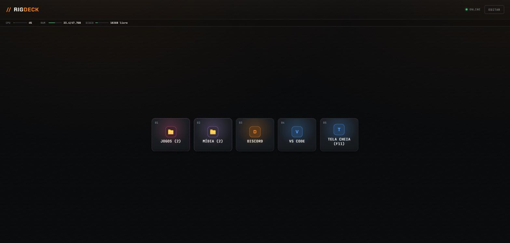

# // RigDeck

🇺🇸 [Read in English](README.md)

**Um Stream Deck sem hardware.** O celular abre uma página web e controla o
PC Windows pela rede local: liga programas, jogos e sites, posiciona janelas
em monitores específicos, entra e sai de tela cheia, encerra o que abriu com
um toque. Nenhum app nativo instalado no celular.



## Sobre

RigDeck nasceu de um problema específico: jogar com amigos exigia abrir o
Discord num monitor e o jogo em outro, toda vez, na mão. Virou um painel de
automação completo: uma grade de botões configuráveis em pastas, igual ao
Stream Deck de verdade, servida como PWA. Um backend pequeno comanda o
Windows por baixo dos panos.

É uma ferramenta pessoal de automação de desktop, pensada pra rodar numa rede
local controlando uma única máquina. Este repositório serve como referência
de arquitetura e como base pra quem quiser adaptar pra própria configuração.

## Como funciona

```
┌─────────────┐         HTTP (rede local)        ┌──────────────────┐
│  Celular /   │ ───────────────────────────────▶ │   Fastify API     │
│  qualquer    │ ◀─────────────────────────────── │   (Node + TS)      │
│  navegador   │            JSON                  └─────────┬────────┘
└─────────────┘                                              │
  PWA estática                                     spawna processos
  (vanilla JS, sem                                            │
   build step)                                                ▼
                                                    ┌──────────────────┐
                                                    │  Scripts          │
                                                    │  PowerShell        │
                                                    └─────────┬────────┘
                                                              │
                                                   Win32 API (SetWindowPos,
                                                   ShowWindow, SendKeys,
                                                   EnumWindows, taskkill...)
                                                              │
                                                              ▼
                                                     Windows de verdade
```

1. **Frontend.** PWA em JavaScript puro, sem framework e sem build step,
   servida como arquivo estático. A grade de botões (presets) organiza em
   pastas, o editor fica embutido no próprio app, e o cliente recarrega
   sozinho quando o servidor sobe uma versão nova.
2. **Backend.** API Fastify em TypeScript. Recebe o pedido de rodar um
   preset, resolve os passos dele e chama o executor.
3. **Executor.** Decide como cada passo roda: abre um programa, manda uma
   tecla, roda um comando, ou fecha algo que já estava aberto.
4. **Scripts PowerShell.** A camada que conversa com o Windows: enumeram
   monitores, movem e redimensionam janelas via Win32 API, extraem ícones de
   `.exe`, descobrem jogos instalados no Steam e na Epic, enviam teclas via
   `SendKeys`.

Cada camada só conhece a interface da vizinha: o frontend não sabe que existe
PowerShell, o executor não sabe que existe uma grade de botões. Dá pra testar
cada uma isolada.

## Funcionalidades

- **Presets em pastas.** Organiza atalhos em pastas aninhadas, igual ao
  Stream Deck físico da Elgato.
- **Três tipos de passo por preset.**
  - `launch`: abre um `.exe`, atalho, protocolo (`steam://`, `epicgames://`)
    ou URL, com posicionamento de janela por monitor e tela cheia opcional.
  - `cmd`: roda um comando de shell qualquer e retorna a saída.
  - `key`: envia uma tecla (F11, ESC, Alt+Enter...) pra janela em foco ou
    pra um processo específico. Inclui `MAXIMIZE`/`RESTORE` como ações de
    janela de verdade, que não dependem do app escutar a tecla.
- **Presets com múltiplos passos.** Um botão abre Spotify, Brave e VS Code de
  uma vez, por exemplo.
- **Posicionamento por monitor.** Cada passo escolhe o monitor e decide se
  entra em tela cheia ou fica numa posição e tamanho específicos.
- **Segurar pra fechar.** Segurar um botão encerra exatamente o que aquele
  preset abriu, rastreado por PID ou HWND. Não mata processos com o mesmo
  nome que já estavam abertos por outro motivo.
- **URLs em janela própria.** Abrem via `--app=`, sem abas nem barra de
  endereço, e fecham individualmente sem derrubar o navegador inteiro.
- **Descoberta automática de programas.** Varre Menu Iniciar, Desktop, e os
  manifestos do Steam e do Epic Games Launcher, e classifica sozinho o que é
  jogo e o que é programa comum.
- **Stats ao vivo.** CPU, RAM e disco livre na barra de status.
- **PWA instalável.** Funciona como app na tela inicial do celular, com
  layout compacto em landscape: até 4 botões por página, numa bandeja
  deslizável, igual ícones de celular.
- **Export e import.** Backup de todos os presets em um JSON.
- **Auto-start sem admin.** Sobe sozinho no login via atalho na pasta
  Inicializar do Windows, sem privilégios elevados.

## Stack

| Camada | Tecnologia |
|---|---|
| Backend | [Fastify](https://fastify.dev) + TypeScript, Node.js 20+ |
| Frontend | JavaScript puro (ES modules), zero framework, zero build step |
| Automação | PowerShell (Win32 API via `Add-Type` inline) |
| Testes | `node:test` nativo, `tsx` como loader |
| Persistência | JSON local (sem banco de dados) |

## Por que Fastify?

O backend original usava Express. A troca pra Fastify e TypeScript foi
deliberada nesta versão pública: tipagem de ponta a ponta, schema de rota
nativo, uma base mais próxima do que se usa em produção. A filosofia
minimalista continua a mesma: sem ORM, sem camada de injeção de dependência,
sem abstração que o projeto não precisa.

## Começando

### Pré-requisitos

- Windows 10/11
- [Node.js](https://nodejs.org) 20 ou mais recente
- PowerShell (já vem no Windows)

### Instalação

```bash
git clone https://github.com/<seu-usuario>/rigdeck.git
cd rigdeck
npm install
npm run build
npm start
```

O servidor sobe em `http://localhost:4321`. Acesse de qualquer dispositivo na
mesma rede local pelo IP da máquina (`http://192.168.x.x:4321`).

Pra desenvolvimento com reload automático:

```bash
npm run dev
```

### Configuração

Copie `.env.example` pra `.env` se quiser mudar a porta ou o caminho do
arquivo de presets:

```bash
cp .env.example .env
```

### Auto-start no login, sem precisar de admin

```powershell
powershell -ExecutionPolicy Bypass -File scripts\install-startup-shortcut.ps1
```

Cria um atalho na pasta Inicializar do Windows que sobe o servidor sozinho a
cada login.

## Uso

1. Abra `http://localhost:4321`, ou o IP da máquina, no celular ou navegador.
2. Toque em **EDITAR** pra abrir o painel de configuração.
3. Crie uma pasta ou um atalho, escolha o tipo de passo (**Abrir**, **Comando
   CMD** ou **Tecla**), preencha o alvo e salve.
4. Toque no botão criado pra rodar o preset. Segure pressionado pra encerrar
   o que ele abriu.

### Exemplo: Discord e jogo em monitores separados

```json
{
  "name": "Sessão de jogo",
  "steps": [
    { "type": "launch", "target": "C:\\...\\Discord.exe", "monitor": 0 },
    { "type": "launch", "target": "steam://rungameid/730", "monitor": 1, "fullscreen": true }
  ]
}
```

## Estrutura do projeto

```
rigdeck/
├── src/
│   ├── server.ts        # rotas Fastify
│   ├── types.ts         # tipos compartilhados
│   └── lib/
│       ├── executor.ts       # decide como cada passo roda
│       ├── presets-store.ts  # persistência (JSON local)
│       ├── launch.ts         # abre programas/URLs
│       ├── stats.ts          # CPU/RAM/disco
│       ├── icons.ts          # extrai ícone de .exe
│       └── monitors.ts, programs.ts, json-array.ts
├── scripts/            # PowerShell: a camada que fala com o Windows
├── public/             # PWA (HTML/CSS/JS puro, sem build)
├── test/               # node:test
└── run-hidden.vbs      # sobe o server sem abrir janela de console
```

## Limitações conhecidas

- **Só Windows.** Todo o controle de janela depende de Win32 API via
  PowerShell.
- **Uma máquina, um usuário, uma rede local.** Não tem autenticação. Não
  exponha a porta 4321 pra internet sem colocar algo na frente, como VPN ou
  um reverse proxy com auth.
- **Rastreamento em memória.** Reiniciar o servidor apaga o rastreamento fino
  de PID e HWND. O fechamento cai de volta pra matar por nome de processo.

## Licença

MIT. Veja [LICENSE](LICENSE).
